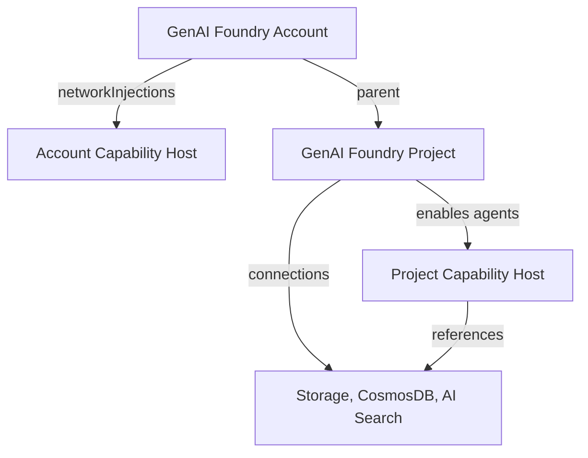

The **GenAI Foundry Project** stack deploys an [Azure AI Foundry](https://learn.microsoft.com/en-us/azure/foundry/) project as a child of an existing GenAI Foundry account. Each project gets its own managed identity, connections to shared resources, and a capability host that enables the Agent Service.

## Architecture

The project creates the following resources on the parent Foundry account:

| Resource | Required | Purpose |
|---|---|---|
| Foundry Project | Yes | Child project with its own managed identity |
| Resource-level Connections | Yes | AppInsights and Key Vault connections (shared across projects) |
| Project-level Connections | Yes | CosmosDB, Storage, and AI Search connections (AAD auth) |
| Project Capability Host | Yes | Enables Agent Service with references to storage connections |
| RBAC Assignments | Yes | Project identity access to shared resources |

### Relationship to the Foundry account

- The **Foundry account** provides the VNet injection infrastructure and shared resources
- The **project** creates connections to those resources using AAD authentication
- The **project capability host** tells the Agent Service which resources to use for storage, threads, and vector search
- All agents in the project inherit the VNet routing and DNS from the account's capability host

### Deployment prerequisites

Before deploying this stack, ensure:

1. The **GenAI Foundry** stack is deployed and the account capability host is in `Succeeded` state
2. All shared resources (Storage, CosmosDB, AI Search, Key Vault, Application Insights) exist
3. The Foundry account has VNet injection configured (if using private networking)

---

## Connections

The project creates connections at two levels:

### Resource-level connections (shared across all projects)

| Connection | Auth | Category | Scope |
|---|---|---|---|
| Application Insights | API Key | AppInsights | Account |
| Key Vault | Account Managed Identity | Azure Key Vault | Account |

### Project-level connections (for capability host)

| Connection | Auth | Category | Scope |
|---|---|---|---|
| Cosmos DB | AAD | CosmosDb | Project |
| Storage Account | AAD | Azure Storage Account | Project |
| AI Search | AAD | Cognitive Search | Project |

---

## Capability host

The project-level capability host enables the Agent Service and maps connections to agent capabilities:

| Property | Connection | Purpose |
|---|---|---|
| `threadStorageConnections` | CosmosDB | Stores agent conversation threads |
| `storageConnections` | Storage Account | Stores agent files and artifacts |
| `vectorStoreConnections` | AI Search | Vector embeddings for knowledge bases |

The capability host is created after:
- All project connections are established
- RBAC assignments have propagated (120-second wait)
- Resource-level connections exist on the parent account

---

## RBAC

### Project identity on shared resources

The project's system-assigned managed identity is granted access to all shared resources:

| Target Resource | Role |
|---|---|
| Foundry Account | Cognitive Services User |
| Storage Account | Storage Blob Data Contributor |
| Cosmos DB | Cosmos DB Operator (control plane) |
| Cosmos DB | Built-in Data Contributor (data plane) |
| AI Search | Search Index Data Contributor |
| AI Search | Search Service Contributor |

### Human access profiles

<Tabs>
<Tab title="Reader">
| Resource | Role |
|---|---|
| Foundry Project | Cognitive Services User |
</Tab>

<Tab title="Contributor">
| Resource | Role |
|---|---|
| Foundry Project | Cognitive Services Contributor |
</Tab>
</Tabs>

---

## Usage

The project stack requires outputs from the parent Foundry deployment:

| Variable | Source |
|---|---|
| `foundry_id` | Foundry account resource ID |
| `foundry_resource_group_name` | Resource group containing the Foundry account |
| `storage_account_name` | Name of the shared Storage Account |
| `cosmosdb_account_name` | Name of the shared Cosmos DB account |
| `ai_search_name` | Name of the shared AI Search service |
| `key_vault_name` | Name of the shared Key Vault |
| `application_insights_name` | Name of the shared Application Insights |

All resource IDs and endpoints are resolved automatically via data sources at plan time.
