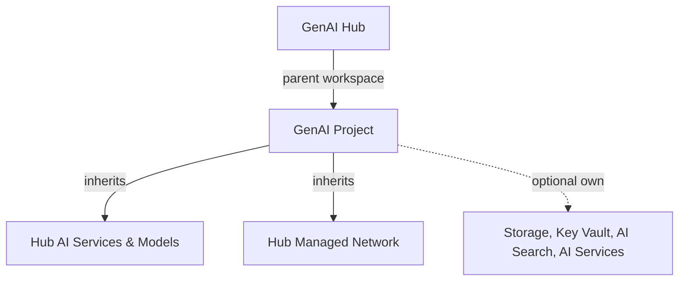

The **GenAI Project** stack deploys an [Azure AI Foundry](https://learn.microsoft.com/en-us/azure/ai-studio/) project as a child of an existing GenAI Hub. Each project gets its own resource group with independently toggleable resources, while inheriting the hub's shared AI services, monitoring, and managed network.

## Architecture

The project creates a separate resource group containing:

| Resource | Required | Purpose |
|---|---|---|
| AI Project | Yes | Child workspace connected to the hub |
| Storage Account | Optional | Project-specific data store |
| Data Lake Storage | Optional | Fabric integration with hierarchical namespace |
| Key Vault | Optional | Project-specific secrets management |
| AI Services | Optional | Dedicated OpenAI and Cognitive Services endpoint |
| AI Search | Optional | Project-specific vector store |
| SQL Database | Optional | Project-specific relational data |

### Relationship to the hub

- The project **inherits** the hub's AI services, model deployments, and shared connections
- The project can optionally deploy **its own** resources for isolation
- When using private networking, outbound rules are created on the hub for project resources

### Resource toggles

Every resource (except the AI Project itself) is opt-in. You can enable or disable storage, data lake, key vault, AI services, AI search, and SQL database independently.

---

## Infrastructure tiers

The project uses the same three tiers as the hub, controlling resource sizes and redundancy for all optional resources.

<Tabs>
<Tab title="Bronze">
  **Development and proof of concept** -- Lowest cost for prototyping and testing. No SLA guarantees, no redundancy, no purge protection.

  | Resource | Configuration |
  |---|---|
  | Storage replication | Locally redundant (LRS) |
  | Data Lake replication | Locally redundant (LRS) |
  | Key Vault | Standard |
  | Key Vault purge protection | Disabled |
  | AI Search | Basic tier, 1 replica, 1 partition |
  | SQL Database | Basic, 2 GB |
</Tab>

<Tab title="Silver">
  **Production workloads** -- Zone-redundant storage, purge protection, and multiple search replicas for production availability and compliance.

  | Resource | Configuration |
  |---|---|
  | Storage replication | Zone-redundant (ZRS) |
  | Data Lake replication | Zone-redundant (ZRS) |
  | Key Vault | Standard |
  | Key Vault purge protection | Enabled |
  | AI Search | Standard tier, 2 replicas, 1 partition |
  | SQL Database | Standard S1, 50 GB |
</Tab>

<Tab title="Gold">
  **Mission-critical workloads** -- Geo-zone-redundant storage, premium key vault with HSM backing, maximum search capacity, and premium SQL for the highest availability SLAs.

  | Resource | Configuration |
  |---|---|
  | Storage replication | Geo-zone-redundant (GZRS) |
  | Data Lake replication | Geo-zone-redundant (GZRS) |
  | Key Vault | Premium (HSM-backed) |
  | Key Vault purge protection | Enabled |
  | AI Search | Standard tier, 3 replicas, 2 partitions |
  | SQL Database | Premium P1, 250 GB |
</Tab>
</Tabs>

---

## Networking

The project mirrors the hub's three network security modes. The project's networking mode must match the hub's setting.

<Tabs>
<Tab title="Public">
  No networking resources. All project resources are publicly accessible.

  Best for quick prototyping and development without compliance constraints.
</Tab>

<Tab title="Inbound Safe">
  A virtual network and private endpoint subnet are created (or existing ones provided). Private endpoints are deployed for all enabled resources.

  Private DNS zones are auto-created and linked to the VNet, or you can supply existing ones.
</Tab>

<Tab title="Inbound + Outbound Safe">
  Same as Inbound Safe, plus:

  - The hub's managed identity is granted **Contributor** on the project resource group
  - Private endpoint outbound rules are created **on the hub workspace** for project resources
  - AI Services outbound rules are auto-managed by the hub when connections are created
</Tab>
</Tabs>

### Private endpoints

When using a private networking mode, private endpoints are created for enabled resources:

| Resource | Sub-resource | Configurable |
|---|---|---|
| Storage Account | Blob (default) | Yes |
| Data Lake Storage | Blob, DFS (default) | Yes |
| Key Vault | Vault | No |
| AI Services | Account | No |
| AI Search | Search Service | No |
| SQL Database | SQL Server | No |

<Tip>
You can bring your own VNet and subnet or let the stack auto-create them. Storage private endpoint sub-resources (blob, file, table, queue, DFS) are configurable per storage account.
</Tip>

---

## Connections

When optional resources are enabled, the project creates workspace connections. AI Services connections include **API key** authentication for Foundry portal compatibility. All other connections use **RBAC (Microsoft Entra ID)**.

| Connection | Condition | Auth | Category |
|---|---|---|---|
| Storage | Storage enabled | Entra ID | Azure Blob |
| Data Lake Storage | Data Lake enabled | Entra ID | Azure Blob |
| AI Search | AI Search enabled | Entra ID | Cognitive Search |
| SQL Database | SQL enabled | Entra ID | Azure SQL |
| AI Services | AI Services enabled | Entra ID | Cognitive Service |
| Azure OpenAI | AI Services enabled | API Key | Azure OpenAI |
| Cognitive Services (default) | AI Services enabled | API Key | Cognitive Service |

---

## RBAC profiles

You can assign Azure AD groups for **Reader** and **Contributor** access across all enabled project resources.

<Tabs>
<Tab title="Reader">
| Resource | Role |
|---|---|
| Resource Group | Reader |
| AI Project | Azure AI Developer |
| Storage | Storage Blob Data Reader |
| Data Lake | Storage Blob Data Reader |
| Key Vault | Key Vault Reader + Key Vault Secrets User |
| AI Services | Cognitive Services User |
| AI Search | Search Index Data Reader |
| SQL Server | Reader |
</Tab>

<Tab title="Contributor">
| Resource | Role |
|---|---|
| Resource Group | Contributor |
| AI Project | Azure AI Administrator |
| Storage | Storage Blob Data Contributor |
| Data Lake | Storage Blob Data Contributor |
| Key Vault | Key Vault Contributor + Key Vault Secrets Officer |
| AI Services | Cognitive Services Contributor |
| AI Search | Search Index Data Contributor + Search Service Contributor |
| SQL Server | SQL DB Contributor |
</Tab>
</Tabs>
